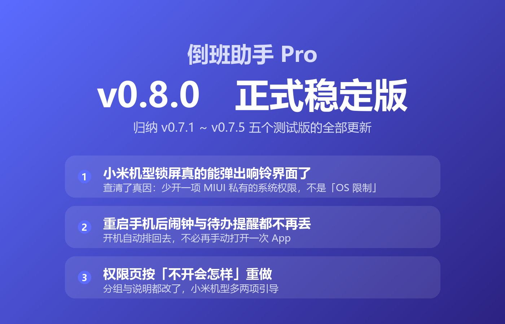
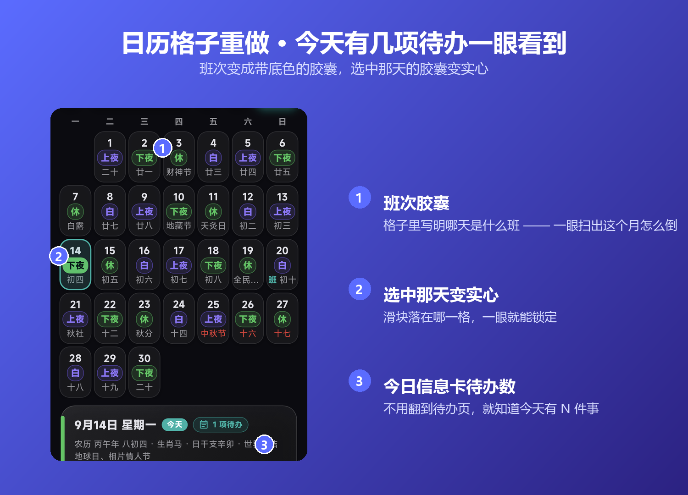
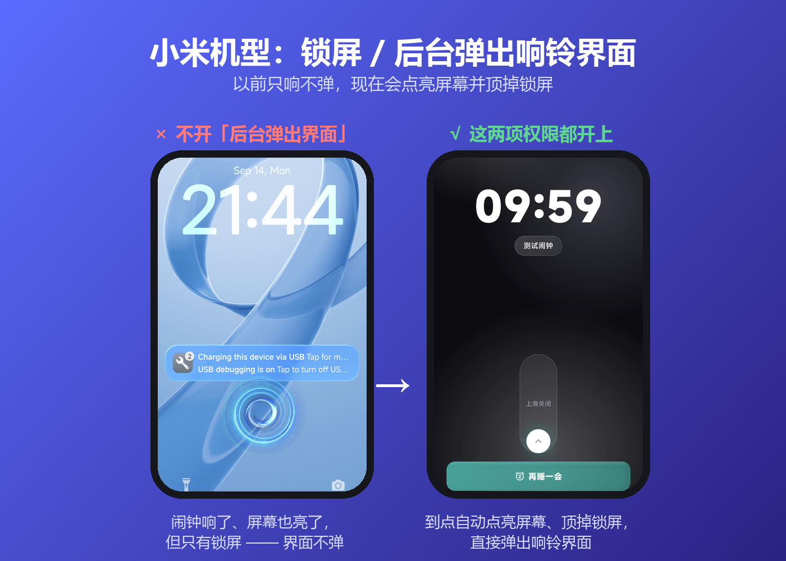
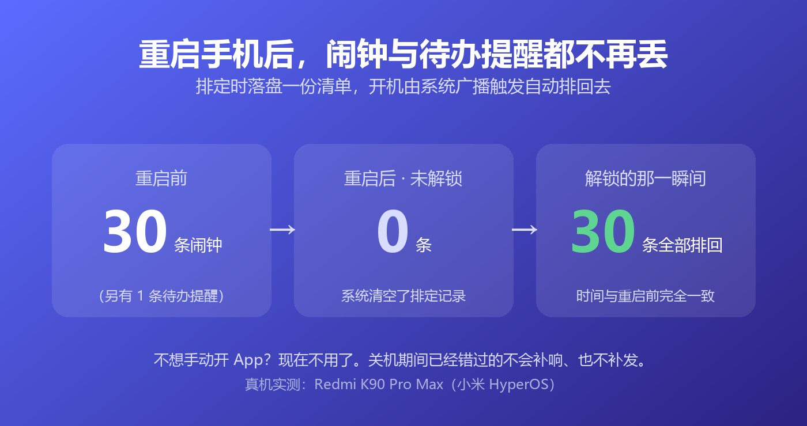
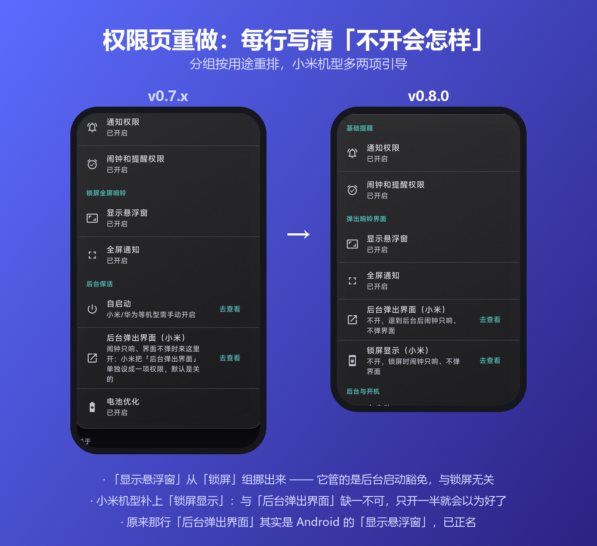
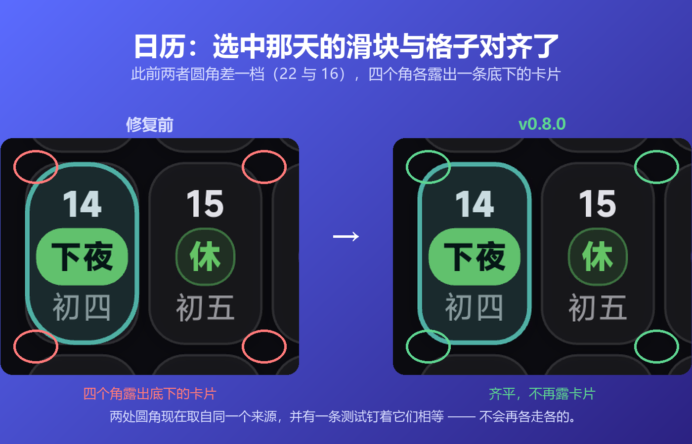

v0.8.0 正式版发了（归纳 0.7.1 ~ 0.7.5 五个测试版）。跟上一个正式版比，主要这几处 👇

- **日历格子重做**：班次变成带底色的胶囊，一眼扫出这个月怎么倒；选中那天的胶囊变实心
- **今天有几项待办，现在直接显示在日历下方的信息卡上**，不用翻到待办页
- **待办提醒真正生效了**（以前设了「提前提醒」，到点什么都不会发生），档位也扩充到「准时 / 提前 5·15·30 分钟 / 1 小时 / 1 天」；还能给待办开「联动闹钟」，到点像班次闹钟一样全屏响铃
- **闹钟铃声可以从手机里挑自己的音频了**（以前只能用内置和系统的）
- **小米机型锁屏 / 后台真的能弹出响铃界面了** —— 以前只响不弹。上次我说「这是系统限制」，**那句是错的**：真因是少开一项 MIUI 私有的权限（「后台弹出界面」和「锁屏显示」缺一不可），权限页里现在能一键跳过去开
- **重启手机后闹钟和待办提醒不再丢**，开机自动排回去，不用再手动打开一次 App
- 顺带修掉一个隐患：以前**关掉闹钟后 App 会留在锁屏上**（锁屏下能直接看到并操作），现在响铃一停就回到锁屏

图在下面，六张 👇

---

<!--
  下面是配图，发帖时按顺序传上去（文件名对应 docs/images/ 里的图）：

  1. v080-cover.png            封面
  2. v080-calendar-chips.png   日历格子重做（班次胶囊 / 选中实心 / 信息卡待办数）
  3. v080-miui-ring.png        小米机型锁屏弹出响铃界面（前 / 后）
  4. v080-reboot.png           重启后自动排回
  5. v080-permissions.png      权限页重做（前 / 后）
  6. v080-calendar.png         日历滑块与格子对齐（前 / 后，修图）

  要更全的版本（含完整修复清单、已知限制、SHA256）见 GitHub Release 的发布说明。
-->

