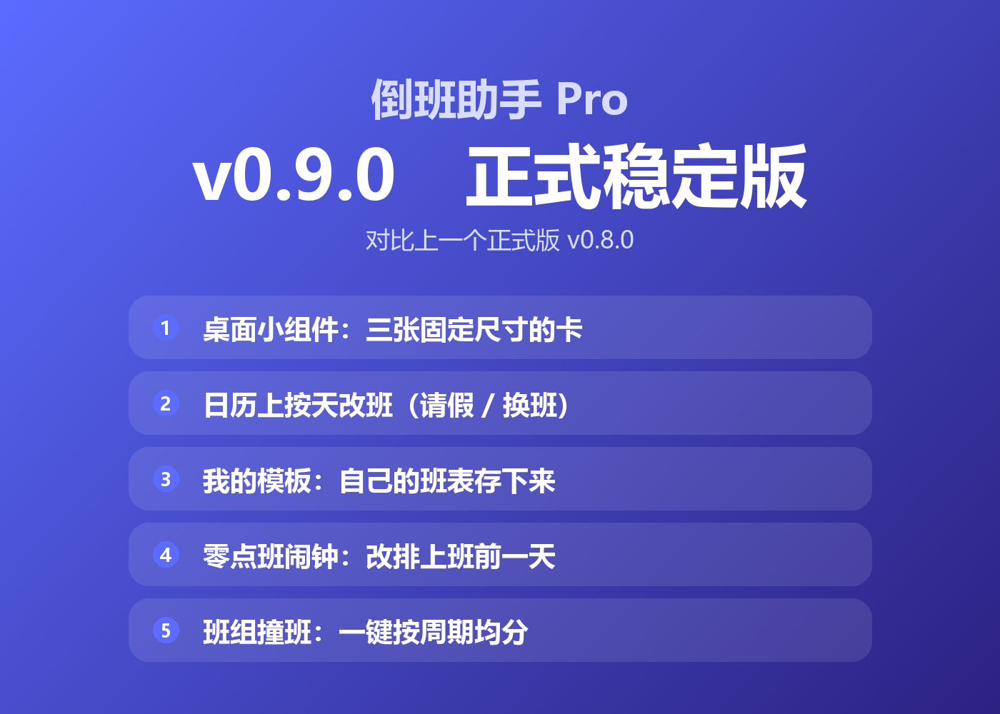
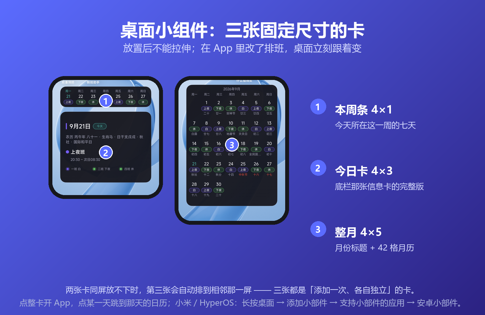
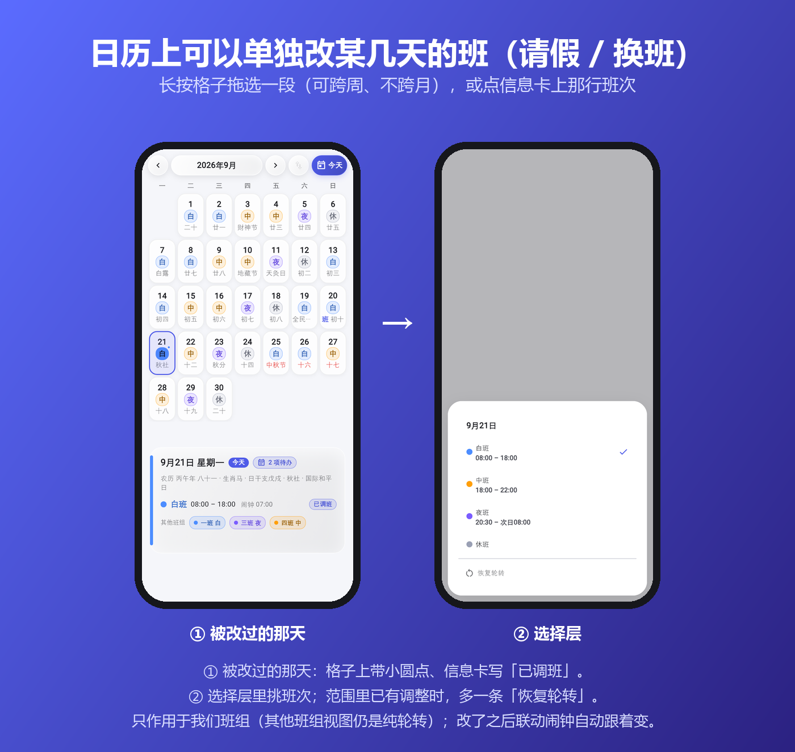
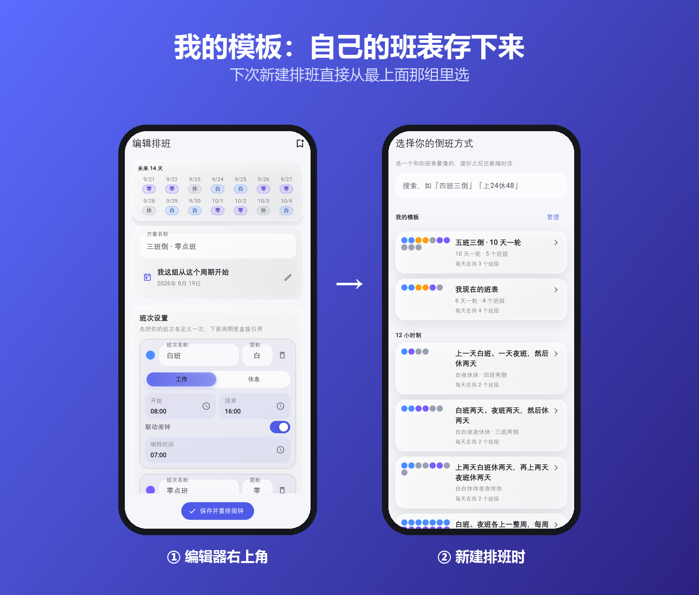
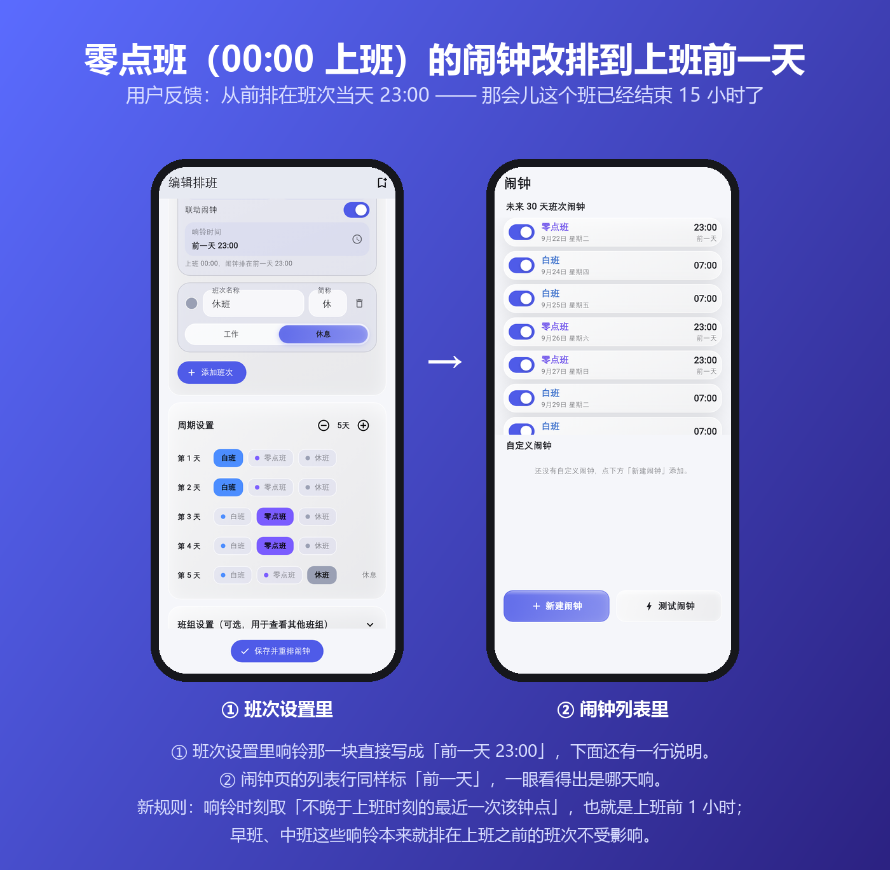
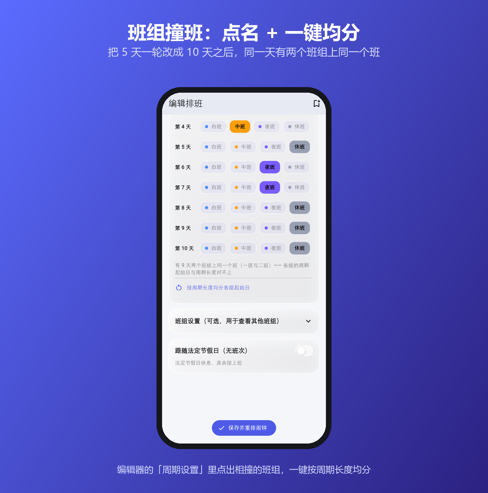

v0.9.0 正式版发了，跟上一个正式版比 👇

① 桌面小组件（三张卡）
② 日历上按天改班：请假、换班
③ 我的模板：自己的班表存下来
④ 零点班闹钟改排上班前一天
⑤ 班组撞班现在会点名 + 一键均分

图 👇

---

<!--
  下面是配图，发帖时按顺序传上去（文件名对应 docs/images/ 里的图）：

  1. v090-cover.png      封面
  2. v090-widgets.png    桌面小组件（真机桌面：本周条 + 今日卡 / 整月，两屏）
  3. v090-override.png   日历上按天改班（被改过的那天 / 选择层）
  4. v090-templates.png  我的模板（编辑器存为模板 / 新建排班时选它）
  5. v090-midnight.png   零点班闹钟改排上班前一天（班次设置 / 闹钟列表）
  6. v090-clash.png      班组撞班点名 + 一键均分

  正文只列「多了哪几件事」，每件事的「以前怎样、现在怎样」在图里 —— 评论区
  装不下长文案。要更全的版本（含完整修复清单、已知限制、SHA256）见 GitHub
  Release 的发布说明。
-->

